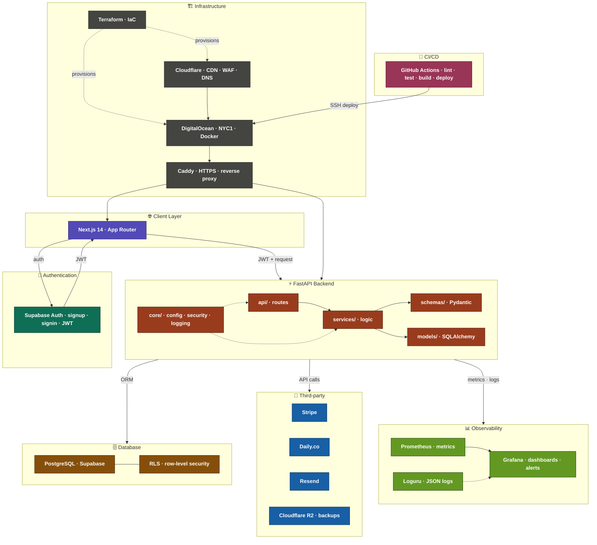

# Architecture — Suzana Music Platform

## Overview

A full-stack platform for Suzana, a professional musician, to offer online music lessons, recorded courses, and subscription plans to students worldwide.

---

## Architecture diagram



---

## Layers

### Client — Next.js 14
- Communicates directly with Supabase Auth for login/signup
- Receives a JWT token after authentication
- Sends JWT on every API call to FastAPI
- Hosted behind Cloudflare CDN for global performance

### Supabase Auth
- Handles identity only — signup, signin, JWT issuance
- Students log in with email + password or magic link
- JWT contains: user ID, role (`student` | `admin`), expiry

### FastAPI backend
- Verifies JWT on every protected request
- Contains all business logic
- Talks to PostgreSQL via SQLAlchemy
- Integrates with Stripe, Daily.co, Resend

**Internal structure:**
```
app/
├── api/          # Route handlers (HTTP layer)
├── core/
│   ├── config.py      # Settings from .env (pydantic-settings)
│   ├── database.py    # SQLAlchemy engine + session
│   ├── log.py         # Loguru — colorized dev, JSON prod
│   ├── security.py    # JWT decode + bcrypt
│   ├── seed.py        # Seed data
│   └── supabase.py    # Supabase client
├── models/       # SQLAlchemy ORM models
├── schemas/      # Pydantic request/response schemas
└── services/     # Business logic (no HTTP knowledge)
```

### PostgreSQL (Supabase)
- Primary database
- Row Level Security (RLS) enabled on all tables
- Students can only access their own rows
- Admin (Suzana) bypasses RLS via service role

**Tables:**
| Table | Description |
|-------|-------------|
| `users` | Students and Suzana (admin) |
| `instruments` | Cello · Piano · Guitar · Music Theory |
| `courses` | Recorded courses per instrument |
| `bookings` | Private lesson bookings |
| `subscriptions` | Monthly subscription plans |

### Observability
| Tool | Purpose |
|------|---------|
| Prometheus | Metrics scraping from FastAPI |
| Grafana | Dashboards, alerts, visualization |
| Loguru | Structured JSON logs in production |

### Third-party services
| Service | Purpose |
|---------|---------|
| Stripe | Payments — card, Apple Pay, Google Pay, PayPal |
| Daily.co | Live video lessons (global, low-latency) |
| Resend | Transactional email |
| Cloudflare R2 | Video storage + nightly DB backups |

---

## Security model

### Authentication flow
```
1. Student submits email + password
2. Supabase Auth verifies → issues JWT
3. Client stores JWT (httpOnly cookie)
4. Every FastAPI request: Authorization: Bearer <JWT>
5. FastAPI: decode JWT → get user ID + role
6. FastAPI: query DB as that user (RLS enforced)
```

### Key security decisions
- **JWT verification** — every protected route uses `get_current_user` dependency
- **RLS** — database-level access control, independent of application code
- **No service role key in frontend** — only FastAPI uses the Supabase service role key
- **HTTPS** — Caddy handles SSL automatically via Let's Encrypt (auto-renews every 90 days)
- **`/docs` disabled in production** — Swagger UI only in development
- **Stripe webhook signature** — verified with `stripe.construct_event()`
- **Cloudflare WAF** — blocks common attack patterns before reaching the server

---

## Infrastructure

### Stack
| Component | Tool |
|-----------|------|
| Server | DigitalOcean Droplet NYC1 |
| IaC | Terraform |
| Containerization | Docker + Docker Compose |
| Reverse proxy | Caddy (HTTPS + auto SSL) |
| CDN + DNS + WAF | Cloudflare |
| Video + file storage | Cloudflare R2 |
| CI/CD | GitHub Actions |
| Monitoring | Grafana + Prometheus |

### Why Caddy over Nginx
- Automatic HTTPS via Let's Encrypt — no certbot, no cron jobs
- HTTP → HTTPS redirect out of the box
- Much simpler config

```
Full Caddy config for this project:
{$DOMAIN} {
    reverse_proxy backend:8000
}
```

### Terraform (IaC)
All infrastructure is defined as code — no manual clicking in dashboards.

```hcl
variable "droplet_size" {
  default = "s-2vcpu-4gb"  # $12/mo — change to scale
}
```

Resources managed by Terraform:
- DigitalOcean Droplet
- Cloudflare DNS records
- Cloudflare WAF rules
- Firewall rules

---

## Scaling strategy

### Phase 1 — Current (single droplet · $12/mo)
Handles ~1,000 concurrent students comfortably.

### Phase 2 — Vertical scaling
Upgrade the Droplet size — one variable change in Terraform:
```
s-2vcpu-4gb  → $12/mo   (current)
s-4vcpu-8gb  → $24/mo
s-8vcpu-16gb → $48/mo
```
~30 seconds of downtime. No code changes needed.

### Phase 3 — Horizontal scaling
Each component scales independently:

| Component | Strategy |
|-----------|---------|
| FastAPI | Multiple Droplets + DigitalOcean Load Balancer |
| PostgreSQL | DigitalOcean Managed DB + read replicas |
| Static assets | Already global via Cloudflare CDN |
| Videos | Already global via Cloudflare R2 |
| Live video | Already global via Daily.co |

### Phase 4 — Kubernetes
DigitalOcean Kubernetes (DOKS) — only if Phase 3 is not enough.

---

## CI/CD pipeline

```
push to dev/main → secrets-scan → lint → test → security → integration tests → frontend checks
git tag v1.x.x   → all above + docker build + push backend + frontend to GHCR
```

### Jobs

| Job | Description |
|-----|-------------|
| secrets-scan | git-secrets scan for AWS keys and secrets |
| lint | ruff + mypy for backend |
| test | pytest unit tests (154 tests · 94% coverage) |
| security | pip-audit for Python deps · npm audit for frontend |
| test-integration | pytest integration tests with real PostgreSQL |
| frontend | TypeScript check · ESLint · npm audit |
| build-and-push | Docker build + push to GHCR (tags only) |

---

## Deployment

### Current — Staging (Railway)

| Service | URL |
|---------|-----|
| Frontend | https://terrific-fulfillment-production-814a.up.railway.app |
| Backend | https://suzana-music-platform-production.up.railway.app |
| Database | Supabase Cloud (West EU — Ireland) |

> Railway staging is used for development and testing only.
> Production will be deployed to DigitalOcean with Terraform.

### Planned — Production (DigitalOcean)
| Component | Tool |
|-----------|------|
| Server | DigitalOcean Droplet NYC1 |
| IaC | Terraform ✅ Ready |
| Reverse proxy | Caddy |
| CDN + DNS + WAF | Cloudflare |
| Database | Supabase Cloud |

---

## Data flow examples

### Student books a private lesson
```
1. Student selects slot + instrument on Next.js
2. POST /api/v1/bookings → FastAPI
3. FastAPI: verify JWT → check availability → create Stripe PaymentIntent
4. Student pays via Stripe Payment Element
5. Stripe fires payment_intent.succeeded webhook
6. FastAPI webhook handler:
   - marks booking as confirmed
   - creates Daily.co room
   - sends confirmation email via Resend
```

### Student watches a recorded course
```
1. Student opens course page on Next.js
2. GET /api/v1/courses/{slug} → FastAPI
3. FastAPI: verify JWT → check course_purchases → return signed R2 URL
4. Next.js: plays video from Cloudflare R2 (edge-served globally)
```

---

## Local development

```bash
# 1. Start Supabase (PostgreSQL + Auth)
supabase start

# 2. Start FastAPI
cd backend
source venv/bin/activate
uvicorn app.main:app --reload --host 0.0.0.0 --port 8000

# 3. Start Next.js
cd frontend
npm run dev
```

### With Docker Compose (recommended)
```bash
docker compose up
```

- Frontend: http://localhost:3000
- Backend: http://localhost:8000
- API docs: http://localhost:8000/docs (development only)

---

## Environment variables

See `backend/.env.example` and `frontend/.env.example` for all required variables.

**Never commit `.env` files.**