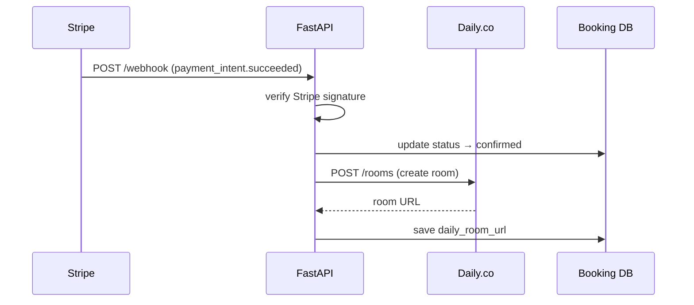

# Daily.co Video Flow

## Overview

A Daily.co room is created automatically after payment is confirmed via Stripe webhook.

## Flow



## Room properties

```json
{
    "name": "booking-{booking_id}",
    "properties": {
        "exp": "<ends_at timestamp>",
        "max_participants": 2,
        "enable_chat": true,
        "enable_screenshare": true
    }
}
```

## Key points

- Room is created automatically — no manual action needed
- Room expires when the lesson ends (`ends_at`)
- Max 2 participants — student and Suzana
- Room URL is stored in `bookings.daily_room_url`
- Room is deleted after the lesson via `delete_room()`

## API key

Daily.co API key is stored in `.env` as `DAILY_API_KEY`.
Never expose this key in frontend code.