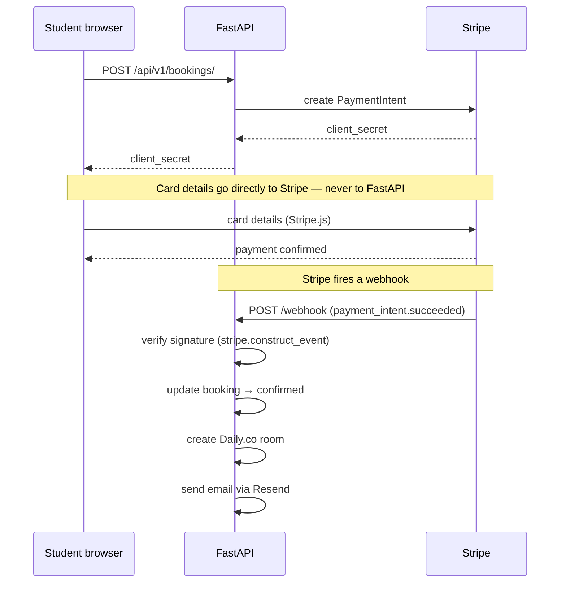

# Stripe Payment Flow

## Overview

Card details never touch our server — Stripe.js handles them directly in the browser.

## Payment flow diagram

## Key concepts

**PaymentIntent** — an object in Stripe representing a payment. FastAPI creates it and returns a `client_secret`.

**Stripe.js** — a JavaScript library that collects card details directly in the browser. Card numbers never reach our server.

**Webhook** — when payment succeeds, Stripe sends an HTTP POST to FastAPI. We verify the signature before processing.

**API keys:**
| Key | Used in | Public? |
|-----|---------|---------|
| `publishable_key` | Frontend (Stripe.js) | Yes |
| `secret_key` | FastAPI only | No — never expose |
| `webhook_secret` | FastAPI webhook handler | No |

## Refund policy

- Cancellation > 24h before lesson → full refund via `stripe.refunds.create()`
- Cancellation < 24h → no refund